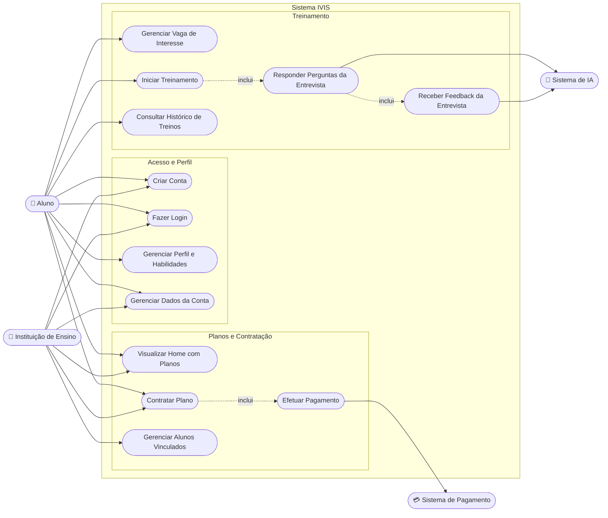
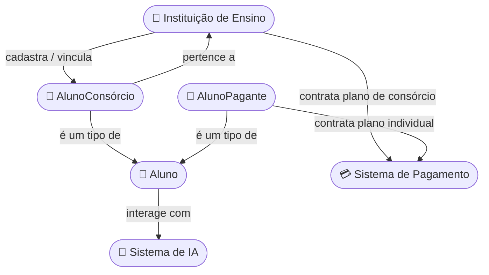

# IVIS — Casos de Uso (Detalhado)

---

## Atores do Sistema

**Atores Principais**
- **Aluno** — pessoa que utiliza a plataforma para treinar entrevistas. Se divide em:
  - *AlunoConsórcio*: vinculado por uma instituição de ensino com plano de consórcio ativo.
  - *AlunoPagante*: contratou um plano individual diretamente.
- **Instituição de Ensino** — contrata um plano de consórcio e gerencia (cadastra/remove) os alunos vinculados a esse plano.

**Atores Secundários**
- **Sistema de IA** — serviço externo responsável por processar as respostas do aluno e gerar as perguntas/feedback da entrevista.
- **Sistema de Pagamento** — gateway externo responsável por processar a contratação (pagamento) de planos individuais e institucionais.

---

## Diagrama de Casos de Uso

> ⚠️ Pendência já sinalizada na validação de requisitos: a seta de `UC10 — Contratar Plano` deveria sair do ator especializado `AlunoPagante`, e não do `Aluno` genérico, já que o AlunoConsórcio não contrata plano próprio (ganha acesso só por vínculo da instituição, via UC11). Ver FA2 do UC10 abaixo.

---

## Diagrama de Relacionamento entre Atores

---

## Casos de Uso Detalhados (Passo a Passo)

Cada caso de uso abaixo segue o modelo: **Ator(es)**, **Descrição**, **Pré-condições**, **Fluxo Principal** (passo a passo do que o usuário faz e o que o sistema responde), **Fluxos Alternativos/Exceções** e **Pós-condições**.

---

### UC1 — Criar Conta

**Ator(es):** Aluno, Instituição de Ensino
**Descrição:** Cadastro inicial de um novo usuário na plataforma.
**Pré-condições:** O e-mail informado ainda não possui conta cadastrada.

**Fluxo Principal:**
1. O usuário acessa a tela de Cadastro.
2. O sistema pergunta o tipo de conta: Aluno ou Instituição de Ensino.
3. O usuário seleciona o tipo de conta.
4. O sistema exibe o formulário correspondente (Aluno: nome, e-mail, senha; Instituição: razão social, CNPJ, e-mail, senha).
5. O usuário preenche os dados solicitados e confirma o cadastro.
6. O sistema valida o formato dos dados (e-mail, senha, CNPJ etc.).
7. O sistema verifica se já existe uma conta com o e-mail informado.
8. O sistema cria a conta e envia um e-mail de confirmação/boas-vindas.
9. O sistema redireciona o usuário para a tela de Login.

**Fluxos Alternativos:**
- **FA1 (E-mail já cadastrado):** no passo 7, se o e-mail já existir, o sistema exibe um erro e sugere fazer login ou usar outro e-mail.
- **FA2 (Dados inválidos):** no passo 6, se algum dado for inválido, o sistema aponta o campo com erro e mantém o usuário no formulário.

**Pós-condições:** Conta criada; usuário apto a fazer login (UC2).

---

### UC2 — Fazer Login

**Ator(es):** Aluno, Instituição de Ensino
**Descrição:** Autenticação do usuário na plataforma.
**Pré-condições:** Usuário já possui conta cadastrada (UC1).

**Fluxo Principal:**
1. O usuário acessa a tela de Login.
2. O usuário informa e-mail e senha e confirma.
3. O sistema valida as credenciais.
4. O sistema gera uma sessão/token de autenticação.
5. O sistema redireciona o usuário para a Home (UC9) já autenticado.

**Fluxos Alternativos:**
- **FA1 (Credenciais inválidas):** no passo 3, se e-mail/senha não conferirem, o sistema exibe erro e mantém o usuário na tela de login.
- **FA2 (Esqueci minha senha):** o usuário seleciona "Esqueci minha senha", informa o e-mail cadastrado, e o sistema envia um link para redefinição.

**Pós-condições:** Usuário autenticado, com sessão ativa.

---

### UC3 — Gerenciar Perfil e Habilidades

**Ator:** Aluno
**Descrição:** Cadastro, edição e remoção das habilidades técnicas do aluno.
**Pré-condições:** Aluno autenticado.

**Fluxo Principal:**
1. O aluno acessa a tela de Perfil de Habilidades.
2. O sistema exibe as habilidades já cadastradas (se houver).
3. O aluno escolhe uma ação:
   - **Adicionar:** informa o nome da habilidade e o nível (ex.: básico, intermediário, avançado) e confirma.
   - **Editar:** seleciona uma habilidade existente, altera os dados e confirma.
   - **Remover:** seleciona uma habilidade e confirma a exclusão.
4. O sistema salva a alteração e atualiza a lista exibida na tela.

**Fluxos Alternativos:**
- **FA1 (Habilidade duplicada):** se o aluno tentar cadastrar uma habilidade já existente, o sistema avisa e sugere editar a habilidade já cadastrada em vez de duplicá-la.

**Pós-condições:** Perfil de habilidades atualizado — usado pelo Sistema de IA para calibrar os próximos treinos (UC5).

---

### UC4 — Gerenciar Vaga de Interesse

**Ator:** Aluno
**Descrição:** Cadastro, edição e exclusão de vagas de interesse usadas para gerar treinos direcionados.
**Pré-condições:** Aluno autenticado.

**Fluxo Principal:**
1. O aluno acessa a tela de Gerenciamento de Vagas.
2. O sistema exibe as vagas já cadastradas (se houver).
3. O aluno escolhe uma ação:
   - **Cadastrar:** informa cargo, tecnologias exigidas, nível de senioridade e requisitos/descrição da vaga, e confirma.
   - **Editar:** seleciona uma vaga existente, altera os dados e confirma.
   - **Excluir:** seleciona uma vaga e confirma a exclusão.
4. Para edição/exclusão, o sistema verifica se a vaga está associada a um treino em andamento.
5. O sistema salva a alteração e atualiza a lista exibida.

**Fluxos Alternativos:**
- **FA1 (Vaga em uso):** no passo 4, se a vaga estiver vinculada a um treino em andamento, o sistema bloqueia a ação e avisa o aluno.

**Pós-condições:** Vaga cadastrada/atualizada, disponível para ser usada em um treino (UC5).

---

### UC5 — Iniciar Treinamento

**Ator:** Aluno
**Descrição:** Início da simulação de entrevista.
**Pré-condições:** Aluno autenticado, com plano ativo (AlunoPagante ou AlunoConsórcio) e com ao menos um perfil de habilidades ou uma vaga cadastrada.

**Fluxo Principal:**
1. O aluno acessa a tela de Treinamento.
2. O sistema pergunta se o treino será baseado no perfil de habilidades geral ou em uma vaga específica já cadastrada.
3. O aluno escolhe a opção (e, se aplicável, seleciona a vaga) e confirma o início.
4. O sistema envia as habilidades e/ou os requisitos da vaga para o Sistema de IA.
5. O sistema exibe a primeira pergunta gerada pela IA, dando início ao fluxo de UC6.

**Fluxos Alternativos:**
- **FA1 (Sem plano ativo):** no passo 1, se o aluno não tiver plano ativo, o sistema o redireciona para a Home (UC9) para contratar um plano.
- **FA2 (Sem habilidades nem vaga cadastrada):** o sistema informa que é necessário cadastrar ao menos uma habilidade (UC3) ou vaga (UC4) antes de iniciar um treino.

**Pós-condições:** Treino iniciado; sessão de entrevista em andamento.

---

### UC6 — Responder Perguntas da Entrevista

**Ator(es):** Aluno / Sistema de IA
**Descrição:** Interação de perguntas e respostas ao longo do treino.
**Pré-condições:** Treino iniciado (UC5).

**Fluxo Principal:**
1. O Sistema de IA apresenta uma pergunta ao aluno.
2. O aluno digita e envia sua resposta.
3. O sistema encaminha a resposta ao Sistema de IA para processamento.
4. O Sistema de IA avalia a resposta e gera a próxima pergunta (ou sinaliza o fim do treino).
5. Os passos 1 a 4 se repetem até o número de perguntas planejado ser atingido ou o aluno decidir encerrar.
6. Ao final, o sistema segue para a geração do feedback (UC7).

**Fluxos Alternativos:**
- **FA1 (Encerramento antecipado):** o aluno pode optar por encerrar o treino antes do fim; o sistema confirma a intenção e, se confirmado, segue para UC7 com as respostas dadas até o momento.
- **FA2 (Falha na IA):** se o Sistema de IA não responder no tempo esperado, o sistema exibe um erro e oferece a opção de tentar novamente ou encerrar o treino.

**Pós-condições:** Todas as perguntas e respostas do treino ficam registradas para a geração do feedback.

---

### UC7 — Receber Feedback da Entrevista

**Ator(es):** Aluno / Sistema de IA
**Descrição:** Geração e exibição da avaliação de desempenho do aluno ao final do treino.
**Pré-condições:** Treino concluído (UC6).

**Fluxo Principal:**
1. O sistema envia o conjunto de perguntas e respostas do treino ao Sistema de IA.
2. O Sistema de IA processa e gera a avaliação (pontos fortes, pontos de melhoria, pontuação geral).
3. O sistema exibe o feedback ao aluno na tela de Feedback.
4. O sistema salva o resultado no histórico de treinos do aluno.

**Fluxos Alternativos:**
- **FA1 (Falha ao gerar feedback):** se o Sistema de IA não conseguir gerar a avaliação, o sistema informa o erro e permite que o aluno solicite a geração novamente.

**Pós-condições:** Feedback exibido ao aluno e registrado no histórico (disponível via UC8).

---

### UC8 — Consultar Histórico de Treinos

**Ator:** Aluno
**Descrição:** Consulta dos treinos já realizados pelo aluno.
**Pré-condições:** Aluno autenticado, com ao menos um treino concluído.

**Fluxo Principal:**
1. O aluno acessa a tela de Histórico.
2. O sistema exibe a lista de treinos realizados (data, vaga/habilidade treinada, resultado resumido).
3. O aluno seleciona um treino específico para ver mais detalhes (opcional).
4. O sistema exibe o feedback completo daquele treino.

**Fluxos Alternativos:**
- **FA1 (Sem treinos realizados):** se o aluno não tiver nenhum treino, o sistema exibe uma mensagem informativa e sugere iniciar um treino (UC5).

**Pós-condições:** Nenhuma alteração de dados — o caso de uso é apenas de consulta.

---

### UC9 — Visualizar Home com Planos

**Ator(es):** Aluno / Instituição de Ensino *(possivelmente também Visitante não autenticado — a confirmar via RF12)*
**Descrição:** Exibição da tela inicial com os planos disponíveis.
**Pré-condições:** Nenhuma, se a Home for pública (a confirmar com a equipe).

**Fluxo Principal:**
1. O usuário acessa a Home da plataforma.
2. O sistema identifica o tipo de usuário (Aluno, Instituição ou Visitante) para decidir quais planos destacar (individuais ou institucionais).
3. O sistema exibe os planos disponíveis, com preço e benefícios de cada um.
4. O usuário pode selecionar um plano para ver mais detalhes ou seguir para a contratação (UC10).

**Fluxos Alternativos:**
- **FA1 (Usuário já possui plano ativo):** se o usuário autenticado já tiver um plano ativo, o sistema destaca essa informação e direciona para "Meu Plano" em vez de insistir em nova contratação.

**Pós-condições:** Nenhuma alteração de dados — apenas visualização.

---

### UC10 — Contratar Plano

**Ator(es):** AlunoPagante / Instituição de Ensino
**Descrição:** Fluxo de contratação de um plano individual (Aluno) ou institucional/consórcio (Instituição).
**Pré-condições:** Usuário autenticado e sem um plano ativo do mesmo tipo.

**Fluxo Principal:**
1. O usuário seleciona um plano na Home (UC9).
2. O sistema exibe os detalhes do plano; se for a Instituição, solicita a quantidade de vagas desejada.
3. O usuário confirma a intenção de contratação.
4. O sistema encaminha o usuário para o fluxo de pagamento (UC12).
5. Após o pagamento ser aprovado, o sistema ativa o plano na conta do usuário.
6. O sistema exibe a confirmação da contratação.

**Fluxos Alternativos:**
- **FA1 (Pagamento recusado):** se o pagamento (UC12) falhar, o plano não é ativado; o sistema informa o motivo e permite nova tentativa.
- **FA2 (AlunoConsórcio tentando contratar plano individual):** o sistema bloqueia a ação e informa que o acesso do aluno já é garantido pelo consórcio da instituição (regra que corrige a pendência apontada no diagrama).

**Pós-condições:** Plano ativo vinculado à conta do usuário.

---

### UC11 — Gerenciar Alunos Vinculados

**Ator:** Instituição de Ensino
**Descrição:** Cadastro e remoção de alunos vinculados ao plano de consórcio contratado.
**Pré-condições:** Instituição autenticada, com um plano de consórcio ativo.

**Fluxo Principal:**
1. A instituição acessa a tela de Gerenciamento de Alunos Vinculados.
2. O sistema exibe a quantidade de vagas do plano (usadas/disponíveis) e a lista de alunos já vinculados.
3. A instituição escolhe uma ação:
   - **Vincular:** informa o e-mail do aluno a ser vinculado e confirma.
   - **Remover:** seleciona um aluno já vinculado e confirma a remoção.
4. Para vincular, o sistema verifica se há vaga disponível no plano.
5. O sistema atualiza o vínculo e a contagem de vagas utilizadas.

**Fluxos Alternativos:**
- **FA1 (Sem vagas disponíveis):** no passo 4, se não houver vaga livre, o sistema informa a instituição e sugere contratar mais vagas (UC10) ou remover outro aluno.
- **FA2 (Aluno já vinculado a outra instituição):** se o e-mail já pertencer a um AlunoConsórcio de outra instituição, o sistema bloqueia o vínculo e informa o motivo.

**Pós-condições:** Lista de alunos vinculados e contagem de vagas do plano atualizadas.

---

### UC12 — Efetuar Pagamento

**Ator(es):** AlunoPagante / Instituição de Ensino / Sistema de Pagamento
**Descrição:** Processamento do pagamento referente à contratação de um plano.
**Pré-condições:** Usuário optou por contratar um plano (UC10).

**Fluxo Principal:**
1. O sistema exibe a tela de pagamento com o valor a ser cobrado.
2. O usuário escolhe a forma de pagamento (ex.: cartão de crédito, boleto, PIX — formas exatas a definir com a equipe).
3. O usuário informa os dados de pagamento solicitados e confirma.
4. O sistema envia os dados ao Sistema de Pagamento (gateway externo).
5. O Sistema de Pagamento processa a transação e retorna o resultado (aprovado ou recusado).
6. O sistema exibe o resultado ao usuário e, se aprovado, retoma o fluxo do UC10 para ativar o plano.

**Fluxos Alternativos:**
- **FA1 (Pagamento recusado):** no passo 5, se a transação for recusada, o sistema informa o motivo (quando disponível) e permite nova tentativa.
- **FA2 (Falha de comunicação com o gateway):** se o Sistema de Pagamento não responder, o sistema informa um erro temporário e orienta uma nova tentativa mais tarde.

**Pós-condições:** Pagamento aprovado e registrado; plano liberado para ativação.

---

### UC13 — Gerenciar Dados da Conta

**Ator(es):** Aluno / Instituição de Ensino
**Descrição:** Controle de perfil da conta — edição de dados cadastrais, alteração de senha e visualização do plano vigente.
**Pré-condições:** Usuário autenticado.

**Fluxo Principal:**
1. O usuário acessa a tela "Minha Conta".
2. O sistema exibe os dados cadastrais atuais (nome/razão social, e-mail, foto/logo) e o plano vigente do usuário.
3. O usuário escolhe uma ação:
   - **Editar dados pessoais:** altera os campos desejados e confirma.
   - **Alterar senha:** informa a senha atual e a nova senha (com confirmação) e confirma.
   - **Consultar plano vigente:** apenas visualiza tipo de plano, validade e benefícios inclusos.
4. O sistema valida os dados informados.
5. O sistema salva as alterações e exibe uma confirmação.

**Fluxos Alternativos:**
- **FA1 (Senha atual incorreta):** ao alterar a senha, se a senha atual informada estiver incorreta, o sistema exibe erro e não realiza a alteração.
- **FA2 (E-mail já em uso):** se o novo e-mail informado já pertencer a outra conta, o sistema bloqueia a alteração e informa o motivo.

**Pós-condições:** Dados da conta atualizados.

---

> ⚠️ Todos os fluxos alternativos e a maior parte dos passos detalhados acima foram elaborados a partir da lógica do sistema descrita nos documentos anteriores (RF, RNF, Histórias de Usuário) — recomendo que a equipe revise passo a passo com o time de UX/Produto antes de considerá-los definitivos, especialmente as regras de negócio de erro (ex.: mensagens exatas, tentativas permitidas).
