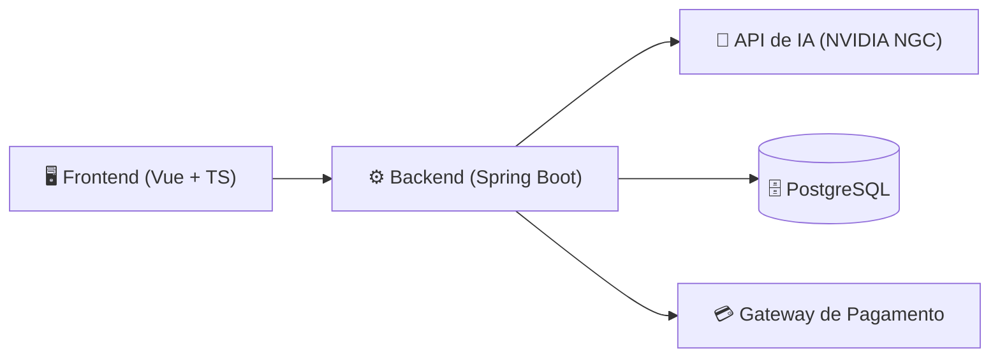

# IVIS — Tecnologias e Ferramentas de Desenvolvimento

Este documento define o stack tecnológico do projeto, organizado pelos 3 módulos definidos pela equipe, mais a infraestrutura e as ferramentas de desenvolvimento compartilhadas entre eles.

---

## Visão Geral da Arquitetura

O IVIS será desenvolvido como **3 módulos independentes**, que se comunicam entre si via API (arquitetura poliglota — cada módulo na linguagem mais adequada ao seu propósito):

| Módulo | Responsabilidade | Linguagem principal |
|---|---|---|
| 1. API de IA | Processa as respostas do candidato e gera perguntas/feedback via NVIDIA NGC | Python (recomendado) ou Java |
| 2. Backend | Regras de negócio, autenticação, planos, vagas, histórico | Java + Spring Boot |
| 3. Frontend | Interface web (Home, Perfil, Treinamento, etc.) | Vue + TypeScript |

---

## Módulo 1 — API de IA

### Decisão: Python

A equipe decidiu utilizar **Python** neste módulo (registro da comparação que embasou a decisão logo abaixo, para referência futura). Como há intenção de colocar esse módulo em **produção**, esta seção também traz considerações de arquitetura voltadas a isso, além do stack de desenvolvimento.

Comparação que embasou a decisão (Python x Java)

| Critério | Python | Java |
|---|---|---|
| Suporte oficial da NVIDIA (SDKs, exemplos, NIM client) | ✅ Nativo e prioritário | ⚠️ Limitado/indireto (via REST/gRPC genérico) |
| Frameworks de orquestração de IA (LangChain, LlamaIndex, etc.) | ✅ Maduro | ❌ Praticamente inexistente |
| Velocidade de prototipação para prompts/perguntas de entrevista | ✅ Alta | ⚠️ Mais verboso |
| Consistência com o restante do stack (que já é Java no Backend) | ❌ Introduz uma segunda linguagem | ✅ Time só precisa dominar uma linguagem |
| Performance/tipagem forte em produção | ⚠️ Suficiente para I/O-bound (chamadas de API) | ✅ Melhor para regras de negócio complexas |
| Facilidade de contratar/treinar a equipe em IA | ✅ Mercado de IA é majoritariamente Python | ⚠️ Menos comum |

### Tecnologias sugeridas (desenvolvimento)
- **Linguagem**: Python 3.11+
- **Framework de API**: FastAPI (assíncrono, tipagem com Pydantic, documentação automática via Swagger/OpenAPI)
- **Servidor ASGI**: Uvicorn
- **Cliente NVIDIA NGC / NIM**: SDK oficial da NVIDIA (`openai`-compatible client ou `requests`/`httpx` para chamadas REST aos endpoints do NIM)
- **Validação de dados**: Pydantic
- **Testes**: Pytest
- **Gerenciador de dependências**: Poetry ou pip + `requirements.txt`

### Considerações para Produção 🆕

Como este módulo tem plano de ir para produção, alguns pontos que valem entrar no planejamento desde já (a maioria não muda o código da aplicação, mas sim como ela é empacotada/operada):

- **Servidor de aplicação**: em produção, não rodar o Uvicorn sozinho — usar **Gunicorn como process manager com workers Uvicorn** (`gunicorn -k uvicorn.workers.UvicornWorker`), para aproveitar múltiplos processos/núcleos.
- **Containerização otimizada**: imagem Docker com **multi-stage build**, partindo de uma base enxuta (ex.: `python:3.11-slim`), para reduzir tamanho e superfície de ataque.
- **Health checks**: expor endpoints como `/health` (liveness) e `/ready` (readiness), usados pelo orquestrador (Docker/Kubernetes) para saber se a instância está apta a receber tráfego.
- **Observabilidade**: logging estruturado (ex.: JSON) e métricas (ex.: Prometheus + Grafana) para acompanhar latência e taxa de erro nas chamadas à NVIDIA NGC — importante porque esse módulo depende de um serviço externo.
- **Segurança na comunicação interna**: autenticação entre Backend e API de IA (ex.: API key ou mTLS), já que esse módulo não deve ficar exposto publicamente na internet, apenas acessível pelo Backend.
- **Gestão de segredos**: chave de acesso à NVIDIA NGC gerenciada via variável de ambiente/secrets manager, nunca versionada no código.
- **Rate limiting / retry / timeout**: proteção contra estouro de custo ou indisponibilidade momentânea da NVIDIA NGC (ex.: usando `tenacity` para retries com backoff).
- **Versionamento de prompt/modelo**: manter controle de qual versão de prompt e de modelo (NGC) está em uso, permitindo rollback caso uma mudança piore a qualidade das entrevistas.
- **Escalabilidade**: planejar desde já se a orquestração em produção será via Docker Compose (mais simples, times pequenos) ou Kubernetes (maior necessidade de autoscaling).
- **CI/CD**: pipeline automatizado de build, testes (Pytest) e deploy para este módulo, com possibilidade de rollback rápido.

> ⚠️ Esses pontos não precisam ser resolvidos agora, no início do projeto — mas é importante já sinalizar no backlog para não serem esquecidos quando o módulo estiver pronto para ir ao ar.

---

## Módulo 2 — Backend

- **Linguagem**: Java (17 ou 21 LTS)
- **Framework principal**: Spring Boot
- **Build tool**: Maven ou Gradle

### Frameworks/bibliotecas do ecossistema Spring necessários
- **Spring Web (MVC)** — construção dos endpoints REST.
- **Spring Data JPA** — persistência e integração com o PostgreSQL.
- **Spring Security** — autenticação e autorização (login de Aluno/Instituição, controle de acesso por tipo de usuário).
- **Spring Validation** — validação de dados de entrada (DTOs).
- **Spring WebClient** (ou OpenFeign) — comunicação HTTP com o Módulo de IA e com o Gateway de Pagamento.
- **JWT (jjwt ou Spring Security OAuth2 Resource Server)** — emissão e validação de token de autenticação.
- **Flyway ou Liquibase** — versionamento e migração do schema do banco de dados.
- **Lombok** — redução de boilerplate (getters/setters/construtores).
- **MapStruct** *(sugestão)* — conversão entre Entidades e DTOs.

### Testes de Backend
- **JUnit 5** — testes unitários.
- **Mockito** — mocks de dependências nos testes unitários.
- **Spring Boot Test** — testes de integração/contexto Spring.
- *(sugestão)* **Testcontainers** — subir um PostgreSQL real em container durante os testes de integração, evitando divergência entre ambiente de teste e produção.

---

## Módulo 3 — Frontend

- **Framework**: Vue (recomenda-se Vue 3, com Composition API)
- **Linguagem**: TypeScript
- **Runtime/gerenciador de pacotes**: Node.js (+ npm ou pnpm)
- **Build tool**: Vite *(sugestão — é o padrão atual para projetos Vue 3, com build e hot-reload muito mais rápidos que alternativas antigas)*
- **Roteamento**: Vue Router *(sugestão, necessário para navegar entre Home, Login, Perfil, Treinamento etc.)*
- **Gerenciamento de estado**: Pinia *(sugestão — sucessor oficial do Vuex para Vue 3)*
- **Cliente HTTP**: Axios *(sugestão, para consumir a API do Backend)*
- **Testes E2E**: Cypress
- **Testes unitários de componentes** *(sugestão)*: Vitest, que já vem integrado ao Vite
- **Padronização de código** *(sugestão)*: ESLint + Prettier

---

## Infraestrutura

- **Containerização**: Docker
- **Orquestração local**: Docker Compose *(sugestão — para subir Backend, API de IA, PostgreSQL e Frontend juntos com um único comando em ambiente de desenvolvimento)*
- **Banco de dados**: PostgreSQL
- **Administração do banco** *(sugestão)*: pgAdmin ou DBeaver

---

## Ferramentas de Desenvolvimento (IDEs)

| Ferramenta | Uso recomendado |
|---|---|
| IntelliJ IDEA | Desenvolvimento do Backend (Java/Spring Boot) |
| VS Code | Desenvolvimento do Frontend (Vue/TypeScript) e do Módulo de IA (Python) |

---

## Resumo Consolidado por Módulo

| Módulo | Linguagem | Framework | Testes | Build/Deploy |
|---|---|---|---|---|
| API de IA ✅ decidido | Python | FastAPI (+ Gunicorn/Uvicorn em produção) | Pytest | Docker |
| Backend | Java | Spring Boot (+ Spring Data JPA, Spring Security, Spring WebClient) | JUnit 5 + Mockito | Docker + Maven/Gradle |
| Frontend | TypeScript | Vue 3 (+ Vite, Vue Router, Pinia) | Cypress (E2E) | Docker + Node.js |
| Banco de Dados | — | PostgreSQL | — | Docker |

---

## Pontos em Aberto para Decisão da Equipe

1. Confirmar se o Backend usará Maven ou Gradle.
2. Confirmar se o gerenciamento de estado do Frontend será Pinia, Vuex ou nenhum (dependendo da complexidade real de estado global da aplicação).
3. Definir se haverá testes unitários no Frontend (Vitest) além dos testes E2E com Cypress, já que o documento só mencionou Cypress.
4. Definir a ferramenta de CI/CD (ex.: GitHub Actions, GitLab CI) para rodar os testes e builds automaticamente — não foi mencionada até agora.
5. 🆕 Definir a orquestração de produção da API de IA (Docker Compose x Kubernetes), já que o módulo tem plano de ir ao ar.
6. 🆕 Definir a ferramenta de observabilidade/monitoramento (ex.: Prometheus + Grafana, Datadog) a ser usada em produção, ao menos para o módulo de IA.