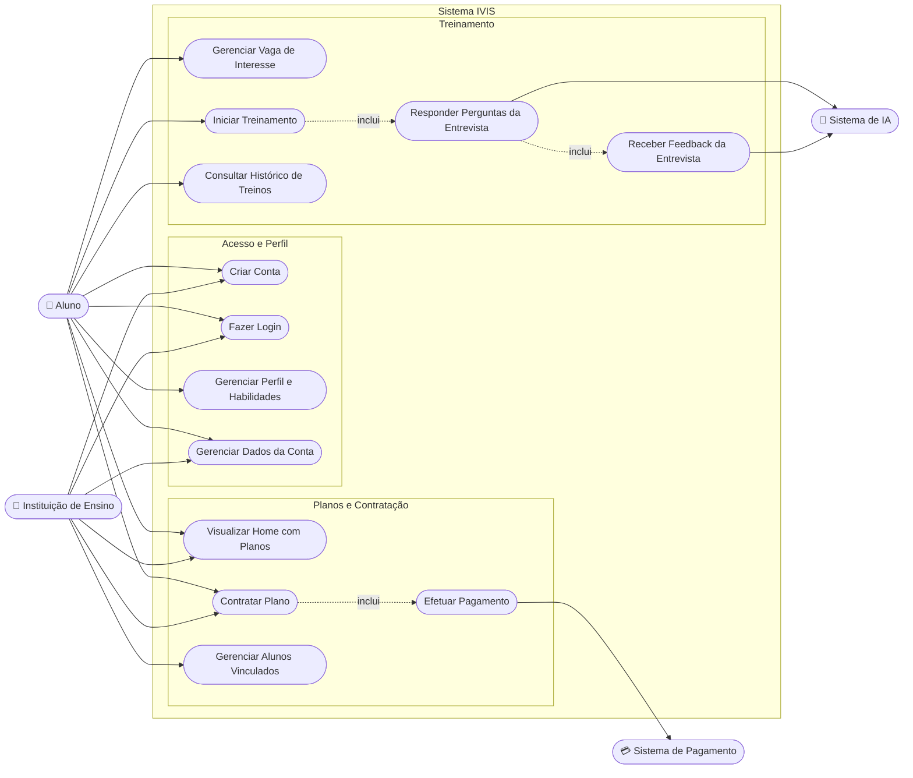
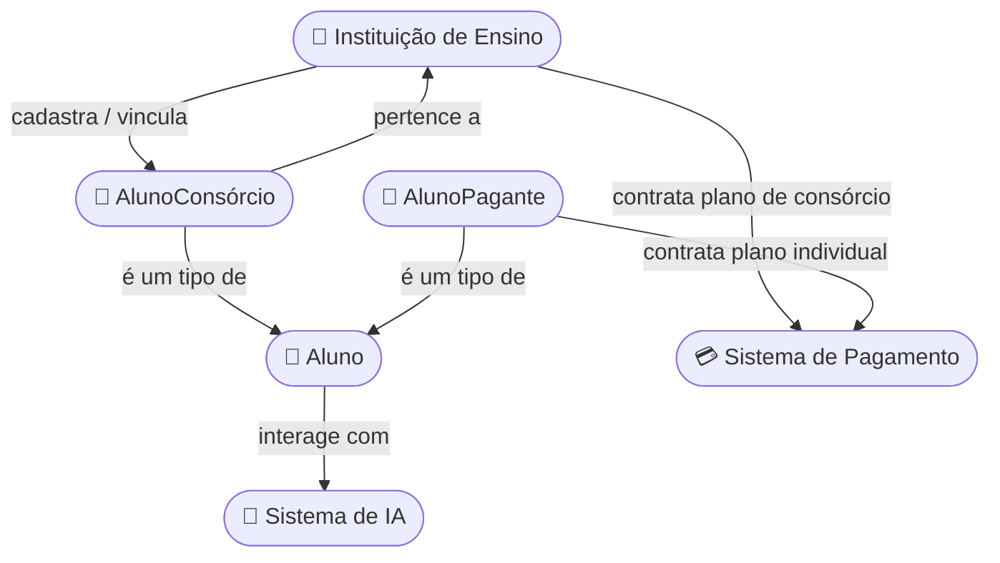

# IVIS — Intelligent Virtual Interview System
### Documento de Visão e Escopo Inicial do Projeto

---

## 1. Visão Geral

O **IVIS (Intelligent Virtual Interview System)** é uma plataforma web baseada em Inteligência Artificial voltada ao treinamento de candidatos para entrevistas de emprego na área de tecnologia.

O sistema conduz o candidato por uma simulação de entrevista, apresentando perguntas de acordo com o perfil de habilidades do usuário e/ou os requisitos de uma vaga específica cadastrada por ele. As respostas são processadas por um modelo de IA, que avalia o desempenho e fornece feedback, aproximando a experiência de uma entrevista técnica real.

Além do treinamento em si, a plataforma passa a contemplar o **ciclo comercial do produto**: uma Home com os planos disponíveis, a contratação de um plano (individual, pelo Aluno Pagante, ou de consórcio, pela Instituição de Ensino) e o controle de perfil/conta dos usuários.

**Problema que o projeto resolve:** candidatos de tecnologia frequentemente têm dificuldade em praticar entrevistas técnicas de forma realista, personalizada e recorrente, pois isso normalmente depende de mentoria humana, que é escassa, cara ou pouco acessível.

**Proposta de valor:** oferecer treinamento de entrevistas ilimitado, personalizado por vaga/habilidade e com feedback objetivo gerado por IA, a um custo acessível — seja via contratação individual, seja via consórcio contratado por uma instituição de ensino para seus alunos.

---

## 2. Escopo do Projeto

### 2.1 Objetivo Geral
Desenvolver uma aplicação web que permita a alunos treinarem entrevistas técnicas de tecnologia de forma automatizada, personalizada e com feedback gerado por IA, com suporte à contratação de planos individuais e institucionais.

### 2.2 Objetivos Específicos
- Permitir o cadastro, login e gerenciamento (controle de perfil) de contas de Aluno e de Instituição de Ensino.
- Permitir o cadastro e gerenciamento do perfil de habilidades técnicas do aluno.
- Permitir o gerenciamento de vagas de interesse, para gerar treinos direcionados.
- Simular uma entrevista técnica interativa, conduzida por IA, com feedback ao final.
- Manter um histórico de treinos realizados para acompanhamento de evolução.
- Exibir uma Home com os planos disponíveis (individual e institucional).
- Permitir que um Aluno Pagante contrate um plano individual.
- Permitir que uma Instituição de Ensino contrate um plano de consórcio e vincule seus alunos a ele.

### 2.3 Dentro do Escopo (MVP — primeira versão)
- Cadastro, login e controle de perfil (dados pessoais, senha, foto) de Aluno e de Instituição de Ensino.
- Cadastro/edição/exclusão de perfil e habilidades do Aluno.
- Gerenciamento (cadastro, edição e exclusão) de vaga de interesse, usada para gerar o treino.
- Simulação de entrevista via IA (perguntas + respostas em texto) e feedback ao final.
- Histórico de treinos por aluno.
- Home com apresentação dos planos disponíveis (individual e institucional/consórcio).
- Contratação de plano individual pelo Aluno Pagante, com pagamento via gateway externo.
- Contratação de plano de consórcio pela Instituição de Ensino, com pagamento via gateway externo.
- Cadastro/vínculo de alunos pela Instituição de Ensino ao plano de consórcio contratado.
- Diferenciação entre AlunoConsórcio e AlunoPagante para fins de acesso ao plano.

### 2.4 Fora do Escopo (nesta etapa — possíveis fases futuras)
- Entrevistas por voz/vídeo com IA (apenas texto no MVP).
- Painel administrativo completo para Gestão ADM/Gestão Suporte (métricas internas, relatórios financeiros etc.).
- Integração com vagas reais de plataformas externas (ex.: LinkedIn, Gupy).
- Gamificação, ranking entre alunos ou certificações.
- Upgrade/downgrade automático de plano, renovação automática e faturamento recorrente avançado.
- Suporte a múltiplos idiomas.

> ⚠️ Validar esta divisão MVP vs. fases futuras com o time e o Product Owner antes de fechar o backlog do Sprint 0.

### 2.5 Público-Alvo
Estudantes e profissionais em transição de carreira para tecnologia (Alunos Pagantes ou Consórcio) e Instituições de Ensino que desejam oferecer o treinamento como benefício/consórcio aos seus alunos.

---

## 3. Stakeholders (Modelo Cebola)

Link do diagrama original: https://canva.link/obupwdeokzl3ggs

| Camada | Stakeholder | Papel em relação ao IVIS |
|---|---|---|
| Núcleo | IVIS | O próprio sistema/produto |
| Infraestrutura | NVIDIA NGC | Provável provedor de infraestrutura/modelos de IA |
| Usuário direto | Alunos | Utilizam a plataforma para treinar entrevistas |
| Usuário direto | Instituição de Ensino | Contrata plano de consórcio e gerencia seus alunos vinculados |
| Operação interna | Gestão Suporte | Suporte técnico/atendimento aos alunos e instituições |
| Operação interna | Gestão ADM | Gestão administrativa e de negócio do produto |
| Agência reguladora | ANPD | Regulação de proteção de dados (LGPD) |
| Órgão regulador | PROCON | Defesa do consumidor |
| Referências de mercado | Alacuna, PRAMP, interviewing.io | Concorrentes/referências de mercado (plataformas de mock interview) |

> ⚠️ Com a Instituição de Ensino passando a ser um ator direto do sistema (e não só uma parceria/stakeholder externo), movi essa linha para "Usuário direto" na tabela acima. Confirmar com o time se ANPD e PROCON entram como *stakeholders regulatórios* (compliance) ou apenas como referência de contexto legal.

---

## 4. Atores do Sistema

**Atores Principais**
- **Aluno** — pessoa que utiliza a plataforma para treinar entrevistas. Se divide em:
  - *AlunoConsórcio*: vinculado por uma instituição de ensino com plano de consórcio ativo.
  - *AlunoPagante*: contratou um plano individual diretamente.
- **Instituição de Ensino** — contrata um plano de consórcio e gerencia (cadastra/remove) os alunos vinculados a esse plano.

**Atores Secundários**
- **Sistema de IA** — serviço externo responsável por processar as respostas do aluno e gerar as perguntas/feedback da entrevista.
- **Sistema de Pagamento** — gateway externo responsável por processar a contratação (pagamento) de planos individuais e institucionais.

> ⚠️ Sugestão: se Gestão Suporte e Gestão ADM forem operar telas no sistema (ex.: aprovar/cancelar um plano, dar suporte a um chamado), eles também devem entrar como atores do sistema — hoje o documento cobre apenas Aluno e Instituição de Ensino como atores de negócio.

---

## 5. Diagrama de Casos de Uso

> Observação 1: "Gerenciar Vaga de Interesse" (UC4) substitui os antigos "Cadastrar Vaga" e "Editar Vaga", já que cadastrar, editar e excluir uma vaga fazem parte da mesma responsabilidade (CRUD de vaga).
> Observação 2: `UC10 — Contratar Plano` é compartilhado pelos dois atores principais, mas com fluxos diferentes: o AlunoPagante contrata um plano individual para si; a Instituição de Ensino contrata um plano de consórcio para múltiplos alunos (que depois são vinculados via `UC11`).

---

## 6. Diagrama de Relacionamento entre Atores

> O vínculo Instituição de Ensino ↔ AlunoConsórcio, antes marcado como funcionalidade futura, passa a ser parte do escopo desta versão (seção 2.3), por isso aparece agora com relação direta (não mais tracejada).

---

## 7. Casos de Uso Detalhados

**UC1 — Criar Conta**
Ator: Aluno / Instituição de Ensino. Cadastro inicial na plataforma, informando dados básicos (e-mail, senha, tipo de conta).

**UC2 — Fazer Login**
Ator: Aluno / Instituição de Ensino. Autenticação na plataforma com e-mail e senha.

**UC3 — Gerenciar Perfil e Habilidades**
Ator: Aluno. O aluno cadastra, edita ou remove habilidades técnicas do seu perfil, usadas pela IA para calibrar o treino.

**UC4 — Gerenciar Vaga de Interesse**
Ator: Aluno. O aluno cadastra, edita ou exclui vagas de interesse, informando dados e requisitos usados para gerar um treino direcionado. Pré-condição para edição/exclusão: a vaga não pode estar em um treino já em andamento.

**UC5 — Iniciar Treinamento**
Ator: Aluno. O aluno seleciona uma vaga (ou seu perfil de habilidades) e inicia a simulação de entrevista.

**UC6 — Responder Perguntas da Entrevista**
Ator: Aluno / Sistema de IA. A IA apresenta perguntas e recebe as respostas do aluno em tempo real.

**UC7 — Receber Feedback da Entrevista**
Ator: Aluno / Sistema de IA. Ao final do treino, a IA gera uma avaliação de desempenho para o aluno.

**UC8 — Consultar Histórico de Treinos**
Ator: Aluno. O aluno visualiza treinos realizados anteriormente e sua evolução.

**UC9 — Visualizar Home com Planos**
Ator: Aluno / Instituição de Ensino. Tela inicial que apresenta os planos disponíveis (individual e institucional), com preços e benefícios.

**UC10 — Contratar Plano**
Ator: Aluno Pagante / Instituição de Ensino. Seleção de um plano na Home e início do fluxo de contratação, que inclui o pagamento (UC12).

**UC11 — Gerenciar Alunos Vinculados**
Ator: Instituição de Ensino. Pré-condição: possuir um plano de consórcio ativo. A instituição cadastra ou remove alunos vinculados ao plano contratado, dentro do limite de vagas disponíveis.

**UC12 — Efetuar Pagamento**
Ator: Aluno Pagante / Instituição de Ensino / Sistema de Pagamento. Processamento do pagamento referente à contratação de um plano, via gateway externo.

**UC13 — Gerenciar Dados da Conta**
Ator: Aluno / Instituição de Ensino. Controle de perfil da conta: edição de dados cadastrais (nome/razão social, e-mail, foto/logo), alteração de senha e visualização do plano vigente.

> ⚠️ UC6, UC7, UC9, UC10, UC11, UC12 e UC13 foram inferidos/expandidos a partir do pedido de incluir controle de perfil, contratação de plano institucional e Home — recomendo validar a redação e os fluxos com o time antes de considerá-los "fechados".

---

## 8. Histórias de Usuário

| ID | História | Critério de Aceite (sugestão) | Prioridade (MoSCoW) |
|---|---|---|---|
| US01 | Como Aluno, quero treinar minhas habilidades para uma entrevista técnica de tecnologia, para alcançar uma vaga e melhorar minhas capacidades. | Dado que o aluno tem um perfil cadastrado, quando ele inicia um treino, então o sistema apresenta perguntas coerentes com seu perfil. | Deve ter |
| US02 | Como Aluno, quero editar minhas habilidades cadastradas, para que a IA me avalie corretamente. | Dado que o aluno acessa seu perfil, quando ele edita uma habilidade, então a alteração é refletida nos próximos treinos. | Deve ter |
| US03 | Como Aluno, quero inserir os dados e requisitos de uma vaga específica, para que o sistema gere um treino focado nela. | Dado que o aluno cadastra uma vaga, quando ele inicia um treino a partir dela, então as perguntas são relacionadas aos requisitos informados. | Deve ter |
| US04 | Como Aluno, quero receber um feedback ao final da entrevista, para saber meus pontos fortes e fracos. | Dado que o treino foi concluído, quando o aluno finaliza, então o sistema exibe uma avaliação com pontos de melhoria. | Deve ter |
| US05 | Como Aluno, quero consultar meu histórico de treinos, para acompanhar minha evolução ao longo do tempo. | Dado que o aluno já realizou treinos, quando ele acessa o histórico, então visualiza data, vaga/habilidade treinada e resultado. | Deveria ter |
| US06 | Como Aluno, quero criar uma conta na plataforma, para poder acessar os recursos de treinamento. | Dado que o visitante preenche e-mail e senha válidos, quando ele confirma o cadastro, então a conta é criada e ele pode fazer login. | Deve ter |
| US07 | Como Aluno, quero fazer login na plataforma, para acessar meu perfil e meus treinos. | Dado que o aluno informa e-mail e senha corretos, quando ele confirma, então é redirecionado à Home autenticado. | Deve ter |
| US08 | Como Aluno, quero editar meus dados pessoais (nome, e-mail, foto), para manter meu perfil atualizado. | Dado que o aluno acessa "Minha Conta", quando ele altera um dado e salva, então a informação é atualizada no sistema. | Deveria ter |
| US09 | Como Aluno, quero alterar minha senha, para manter minha conta segura. | Dado que o aluno informa a senha atual e uma nova senha válida, quando ele confirma, então a senha é atualizada. | Deveria ter |
| US10 | Como Aluno, quero visualizar a Home com os planos disponíveis, para entender as opções antes de contratar. | Dado que o usuário acessa a Home, quando a página carrega, então os planos individuais são exibidos com preço e benefícios. | Deve ter |
| US11 | Como Aluno Pagante, quero contratar um plano diretamente pela plataforma, para ter acesso ao treinamento. | Dado que o aluno seleciona um plano na Home, quando ele conclui o pagamento, então seu status muda para AlunoPagante ativo. | Deve ter |
| US12 | Como Aluno, quero visualizar os detalhes do meu plano atual (validade, benefícios), para saber o que tenho direito de usar. | Dado que o aluno possui um plano ativo, quando ele acessa "Meu Plano", então vê validade, tipo de plano e benefícios inclusos. | Deveria ter |
| US13 | Como Aluno, quero excluir uma vaga cadastrada que não uso mais, para manter minha lista de vagas organizada. | Dado que a vaga não está em um treino em andamento, quando o aluno confirma a exclusão, então a vaga é removida da sua lista. | Poderia ter |
| US14 | Como Instituição de Ensino, quero criar uma conta na plataforma, para poder contratar um plano de consórcio. | Dado que a instituição preenche os dados obrigatórios (razão social, CNPJ, e-mail, senha), quando confirma o cadastro, então a conta é criada. | Deve ter |
| US15 | Como Instituição de Ensino, quero fazer login na plataforma, para gerenciar meu plano e meus alunos. | Dado que a instituição informa e-mail e senha corretos, quando confirma, então acessa seu painel autenticado. | Deve ter |
| US16 | Como Instituição de Ensino, quero visualizar a Home com os planos institucionais disponíveis, para escolher o mais adequado. | Dado que a instituição acessa a Home, quando a página carrega, então os planos de consórcio são exibidos com preço por aluno e quantidade de vagas. | Deve ter |
| US17 | Como Instituição de Ensino, quero contratar um plano de consórcio, para oferecer o treinamento aos meus alunos. | Dado que a instituição seleciona um plano de consórcio, quando conclui o pagamento, então o plano é ativado com a quantidade de vagas contratadas. | Deve ter |
| US18 | Como Instituição de Ensino, quero cadastrar/vincular um aluno ao meu plano de consórcio, para que ele tenha acesso gratuito via consórcio. | Dado que a instituição tem um plano ativo com vagas disponíveis, quando cadastra o e-mail do aluno, então ele passa a ser AlunoConsórcio. | Deve ter |
| US19 | Como Instituição de Ensino, quero remover um aluno vinculado ao meu plano, para liberar a vaga para outro aluno. | Dado que a instituição seleciona um aluno vinculado, quando confirma a remoção, então a vaga do plano volta a ficar disponível. | Deveria ter |
| US20 | Como Instituição de Ensino, quero visualizar a quantidade de vagas do meu plano de consórcio já utilizadas e disponíveis, para controlar meus vínculos. | Dado que a instituição possui um plano ativo, quando acessa o painel de alunos, então vê o total de vagas, quantas estão em uso e quantas estão livres. | Deveria ter |

---

## 9. Requisitos Funcionais (RF)

**Acesso e Perfil**
- **RF01**: O sistema deve permitir que Aluno e Instituição de Ensino criem conta e façam login.
- **RF02**: O sistema deve permitir que Aluno e Instituição de Ensino gerenciem os dados da própria conta (controle de perfil: dados pessoais/institucionais, foto/logo, senha).
- **RF03**: O sistema deve permitir que o Aluno gerencie seu perfil de habilidades técnicas.

**Treinamento**
- **RF04**: O sistema deve permitir que o Aluno gerencie (cadastre, edite e exclua) vagas de interesse para treinamento.
- **RF05**: O sistema deve realizar a simulação de entrevista (treinamento) processando as respostas via IA.
- **RF06**: O sistema deve gerar um feedback/avaliação de desempenho ao final de cada treino.
- **RF07**: O sistema deve armazenar o histórico de treinos realizados por aluno.

**Planos e Contratação**
- **RF08**: O sistema deve exibir uma Home com os planos disponíveis (individual e institucional/consórcio), incluindo preço e benefícios.
- **RF09**: O sistema deve permitir que o Aluno Pagante contrate um plano individual diretamente pela plataforma.
- **RF10**: O sistema deve permitir que a Instituição de Ensino contrate um plano de consórcio, definindo a quantidade de vagas.
- **RF11**: O sistema deve processar pagamentos de contratação de planos por meio de um gateway de pagamento externo.
- **RF12**: O sistema deve permitir que a Instituição de Ensino cadastre/vincule e remova alunos dentro do limite de vagas do plano de consórcio contratado.
- **RF13**: O sistema deve diferenciar o acesso de AlunoConsórcio e AlunoPagante conforme o plano contratado/vinculado.
- **RF14** *(sugerido)*: O sistema deve permitir que a Instituição de Ensino visualize a quantidade de vagas do plano já utilizadas e disponíveis.

## 10. Requisitos Não Funcionais (RNF)

- **RNF01**: O sistema deve ser acessível via navegador web (Aplicação Web).
- **RNF02** *(sugerido)*: O sistema deve estar em conformidade com a LGPD, dado o tratamento de dados pessoais de alunos e instituições (relevante frente à ANPD como stakeholder).
- **RNF03** *(sugerido)*: O tempo de resposta da IA durante a simulação de entrevista não deve comprometer a fluidez da conversa (definir SLA, ex.: resposta em até X segundos).
- **RNF04** *(sugerido)*: O sistema deve ser responsivo, funcionando em desktop e dispositivos móveis.
- **RNF05** *(sugerido)*: O sistema deve garantir disponibilidade adequada para uso educacional (definir % de uptime esperado).
- **RNF06** *(sugerido)*: O sistema não deve armazenar diretamente dados sensíveis de pagamento (ex.: número de cartão), delegando o processamento a um gateway certificado (PCI-DSS).
- **RNF07** *(sugerido)*: O sistema deve garantir que apenas a própria Instituição de Ensino visualize/gerencie os alunos vinculados ao seu plano (isolamento de dados entre instituições).

> ⚠️ Todos os itens marcados como "sugerido" são propostas para a equipe validar, ajustar ou descartar — não substituem a definição formal do time.

---

## 11. Mapeamento de Telas (Prototipação Inicial)

- **Tela de Cadastro/Login** — criação de conta e autenticação de Aluno e Instituição de Ensino.
- **Tela Home** — apresentação dos planos disponíveis (individual e institucional), com preços e benefícios.
- **Tela de Contratação/Pagamento de Plano** — seleção do plano e fluxo de pagamento.
- **Tela de Perfil / Minha Conta** — controle de perfil: dados pessoais/institucionais, foto/logo, senha, plano vigente.
- **Tela de Perfil de Habilidades** — edição das habilidades técnicas do Aluno.
- **Tela de Gerenciamento de Vagas** — cadastro, edição e exclusão dos requisitos da vaga desejada.
- **Tela de Treinamento** — interface de simulação de entrevista da vaga selecionada.
- **Tela de Feedback** — exibição do resultado/avaliação ao fim do treino.
- **Tela de Histórico** — listagem dos treinos já realizados.
- **Tela de Gerenciamento de Alunos Vinculados** *(Instituição de Ensino)* — cadastro/remoção de alunos e visualização de vagas usadas/disponíveis do plano de consórcio.

---

## 12. Glossário

| Termo | Significado |
|---|---|
| IVIS | Intelligent Virtual Interview System |
| Aluno | Usuário final da plataforma que realiza os treinos |
| Instituição de Ensino | Organização que contrata um plano de consórcio para seus alunos |
| Consórcio | Modalidade de acesso via instituição de ensino parceira |
| Plano | Oferta comercial (individual ou institucional) que dá acesso à plataforma |
| Home | Tela inicial com a apresentação dos planos disponíveis |
| Gateway de Pagamento | Sistema externo responsável por processar pagamentos de forma segura |
| Treinamento | Sessão de simulação de entrevista |
| Feedback | Avaliação gerada pela IA ao final do treino |

---

## 13. Próximos Passos Sugeridos

1. Validar com o time o escopo do MVP (seção 2.3/2.4), especialmente o fluxo de pagamento e contratação de plano.
2. Revisar e priorizar as 20 Histórias de Usuário (seção 8) para os próximos Sprints.
3. Detalhar os RF/RNF sugeridos e transformá-los em critérios de aceite.
4. Definir wireframes de baixa fidelidade para as telas mapeadas, priorizando Home, Contratação de Plano e Gerenciamento de Alunos Vinculados.
5. Definir qual provedor de IA (ex.: NVIDIA NGC) e qual gateway de pagamento serão usados, avaliando custo, latência e requisitos de segurança (RNF06).
6. Detalhar as regras de negócio do plano de consórcio (quantidade de vagas, o que ocorre ao esgotar/cancelar/renovar o plano).