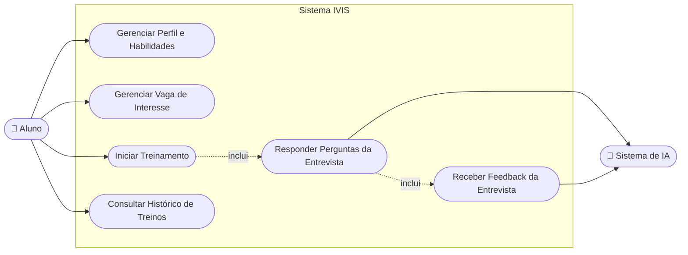
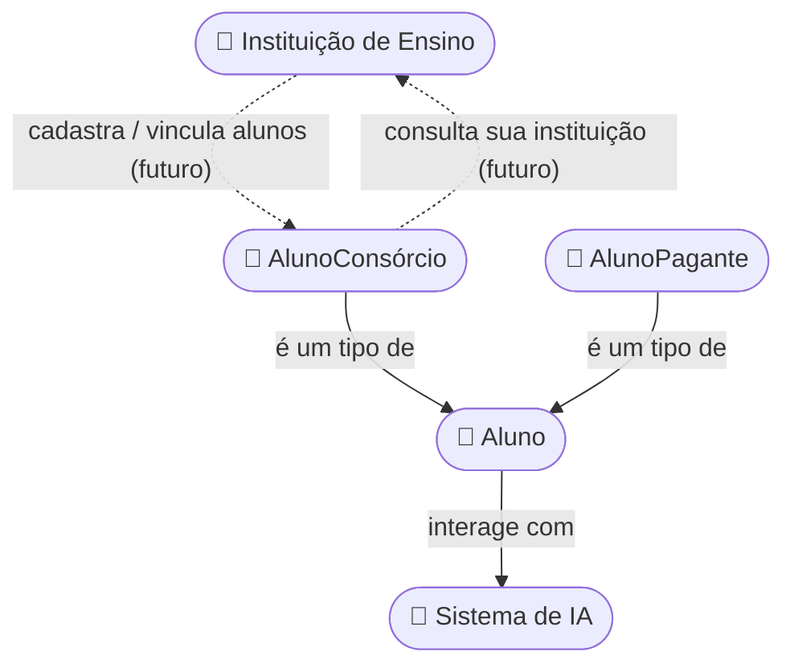

# IVIS — Intelligent Virtual Interview System
### Documento de Visão e Escopo Inicial do Projeto

---

## 1. Visão Geral

O **IVIS (Intelligent Virtual Interview System)** é uma plataforma web baseada em Inteligência Artificial voltada ao treinamento de candidatos para entrevistas de emprego na área de tecnologia.

O sistema conduz o candidato por uma simulação de entrevista, apresentando perguntas de acordo com o perfil de habilidades do usuário e/ou os requisitos de uma vaga específica cadastrada por ele. As respostas são processadas por um modelo de IA, que avalia o desempenho e fornece feedback, aproximando a experiência de uma entrevista técnica real.

**Problema que o projeto resolve:** candidatos de tecnologia frequentemente têm dificuldade em praticar entrevistas técnicas de forma realista, personalizada e recorrente, pois isso normalmente depende de mentoria humana, que é escassa, cara ou pouco acessível.

**Proposta de valor:** oferecer treinamento de entrevistas ilimitado, personalizado por vaga/habilidade e com feedback objetivo gerado por IA, a um custo acessível (inclusive via consórcio com instituições de ensino).

---

## 2. Escopo do Projeto

### 2.1 Objetivo Geral
Desenvolver uma aplicação web que permita a alunos treinarem entrevistas técnicas de tecnologia de forma automatizada, personalizada e com feedback gerado por IA.

### 2.2 Objetivos Específicos
- Permitir o cadastro e gerenciamento do perfil de habilidades técnicas do aluno.
- Permitir o gerenciamento de vagas de interesse, para gerar treinos direcionados.
- Simular uma entrevista técnica interativa, conduzida por IA.
- Processar e avaliar as respostas do candidato, fornecendo feedback.
- Manter um histórico de treinos realizados para acompanhamento de evolução.

### 2.3 Dentro do Escopo (MVP — primeira versão)
- Cadastro/edição/exclusão de perfil e habilidades do Aluno.
- Gerenciamento (cadastro, edição e exclusão) de vaga de interesse, usada para gerar o treino.
- Simulação de entrevista via IA (perguntas + respostas em texto).
- Feedback/avaliação ao final do treino.
- Diferenciação entre AlunoConsórcio e AlunoPagante para fins de acesso ao plano.

### 2.4 Fora do Escopo (nesta etapa — possíveis fases futuras)
- Entrevistas por voz/vídeo com IA (apenas texto no MVP).
- Painel administrativo completo para instituições de ensino (Gestão ADM).
- Cadastro de alunos pela instituição de ensino (vínculo instituição ↔ aluno) — ver seção 6.
- Integração com vagas reais de plataformas externas (ex.: LinkedIn, Gupy).
- Gamificação, ranking entre alunos ou certificações.
- Suporte a múltiplos idiomas.

> ⚠️ validar esta divisão MVP vs. fases futuras

### 2.5 Público-Alvo
Estudantes e profissionais em transição de carreira para tecnologia, matriculados diretamente (pagantes) ou via consórcio com instituições de ensino parceiras.

---

## 3. Stakeholders (Modelo Cebola)

Link do diagrama original: https://canva.link/obupwdeokzl3ggs

| Camada | Stakeholder | Papel em relação ao IVIS |
|---|---|---|
| Núcleo | IVIS | O próprio sistema/produto |
| Infraestrutura | NVIDIA NGC | Provável provedor de infraestrutura/modelos de IA |
| Usuário direto | Alunos | Utilizam a plataforma para treinar entrevistas |
| Operação interna | Gestão Suporte | Suporte técnico/atendimento aos alunos |
| Operação interna | Gestão ADM | Gestão administrativa e de negócio do produto |
| Parceiros | Instituição de Ensino | Oferece o IVIS via consórcio aos seus alunos |
| Agência reguladora | ANPD | Regulação de proteção de dados (LGPD) |
| Órgão regulador | PROCON | Defesa do consumidor |
| Referências de mercado | Alacuna, PRAMP, interviewing.io | Concorrentes/referências de mercado (plataformas de mock interview) |

> ⚠️ Confirmar se ANPD e PROCON entram como *stakeholders regulatórios* (compliance) ou apenas como referência de contexto legal.

---

## 4. Atores do Sistema

**Ator Principal**
- **Aluno** — pessoa que utiliza a plataforma para treinar entrevistas. Se divide em:
  - *AlunoConsórcio*: matriculado em instituição de ensino com plano de consórcio.
  - *AlunoPagante*: contratou o plano diretamente.

**Ator Secundário**
- **Sistema de IA** — serviço externo responsável por processar as respostas do aluno e gerar as perguntas/feedback da entrevista.

**Ator Futuro (fora do MVP)**
- **Instituição de Ensino** — poderá cadastrar/vincular seus próprios alunos na plataforma (ver seção 6).

> ⚠️ Se Gestão Suporte e Gestão ADM forem operar telas no sistema (e não apenas nos bastidores), eles também devem entrar como atores do sistema — hoje o documento só menciona o Aluno.

---

## 5. Diagrama de Casos de Uso

> Observação: "Gerenciar Vaga de Interesse" (UC2) substitui os antigos "Cadastrar Vaga" e "Editar Vaga", já que cadastrar, editar e excluir uma vaga fazem parte da mesma responsabilidade (CRUD de vaga).

---

## 6. Diagrama de Relacionamento entre Atores

Este diagrama antecipa a evolução do relacionamento entre **Instituição de Ensino** e **Aluno**: hoje a instituição apenas "dá acesso" ao consórcio, mas futuramente ela poderá cadastrar/vincular os alunos diretamente (e o aluno poderá visualizar a qual instituição pertence — relação nos dois sentidos).

> ⚠️ As relações tracejadas (linhas pontilhadas) representam o vínculo **futuro** Instituição ↔ AlunoConsórcio, ainda fora do MVP (ver seção 2.4). Sugiro que, quando essa funcionalidade for priorizada, a Instituição de Ensino também entre como ator principal no Diagrama de Casos de Uso da seção 5.

---

## 7. Casos de Uso Detalhados

**UC1 — Gerenciar Perfil e Habilidades**
Ator: Aluno. O aluno cadastra, edita ou remove habilidades técnicas do seu perfil, usadas pela IA para calibrar o treino.

**UC2 — Gerenciar Vaga de Interesse**
Ator: Aluno. O aluno cadastra, edita ou exclui vagas de interesse, informando dados e requisitos usados para gerar um treino direcionado. Pré-condição para edição/exclusão: a vaga não pode estar em um treino já em andamento.

**UC3 — Iniciar Treinamento**
Ator: Aluno. O aluno seleciona uma vaga (ou seu perfil de habilidades) e inicia a simulação de entrevista.

**UC4 — Responder Perguntas da Entrevista**
Ator: Aluno / Sistema de IA. A IA apresenta perguntas e recebe as respostas do aluno em tempo real.

**UC5 — Receber Feedback da Entrevista**
Ator: Aluno / Sistema de IA. Ao final do treino, a IA gera uma avaliação de desempenho para o aluno.

**UC6 — Consultar Histórico de Treinos**
Ator: Aluno. O aluno visualiza treinos realizados anteriormente e sua evolução.

> ⚠️ UC4, UC5 e UC6 - validar a redação antes de considerá "fechados".

---

## 8. Histórias de Usuário

| ID | História | Critério de Aceite (sugestão) | Prioridade (MoSCoW) |
|---|---|---|---|
| US01 | Como Aluno, quero treinar minhas habilidades para uma entrevista técnica de tecnologia, para alcançar uma vaga e melhorar minhas capacidades. | Dado que o aluno tem um perfil cadastrado, quando ele inicia um treino, então o sistema apresenta perguntas coerentes com seu perfil. | Must |
| US02 | Como Aluno, quero editar minhas habilidades cadastradas, para que a IA me avalie corretamente. | Dado que o aluno acessa seu perfil, quando ele edita uma habilidade, então a alteração é refletida nos próximos treinos. | Must |
| US03 | Como Aluno, quero inserir os dados e requisitos de uma vaga específica, para que o sistema gere um treino focado nela. | Dado que o aluno cadastra uma vaga, quando ele inicia um treino a partir dela, então as perguntas são relacionadas aos requisitos informados. | Must |
| US04 (nova, sugerida) | Como Aluno, quero receber um feedback ao final da entrevista, para saber meus pontos fortes e fracos. | Dado que o treino foi concluído, quando o aluno finaliza, então o sistema exibe uma avaliação com pontos de melhoria. | Must |
| US05 (nova, sugerida) | Como Aluno, quero consultar meu histórico de treinos, para acompanhar minha evolução ao longo do tempo. | Dado que o aluno já realizou treinos, quando ele acessa o histórico, então visualiza data, vaga/habilidade treinada e resultado. | Should |
| US06 (nova, sugerida, fora do MVP) | Como Instituição de Ensino, quero cadastrar meus alunos na plataforma, para que eles tenham acesso automático ao plano de consórcio. | Dado que a instituição está autenticada, quando ela cadastra um CPF/e-mail de aluno, então esse aluno passa a ter acesso como AlunoConsórcio. | Could (futuro) |

---

## 9. Requisitos Funcionais (RF)

- **RF01**: O sistema deve permitir que o Aluno gerencie seu perfil e habilidades técnicas.
- **RF02**: O sistema deve permitir que o Aluno gerencie (cadastre, edite e exclua) vagas de interesse para treinamento.
- **RF03**: O sistema deve realizar a simulação de entrevista (treinamento) processando as respostas via IA.
- **RF04** *(sugerido)*: O sistema deve gerar um feedback/avaliação de desempenho ao final de cada treino.
- **RF05** *(sugerido)*: O sistema deve armazenar o histórico de treinos realizados por aluno.
- **RF06** *(sugerido)*: O sistema deve diferenciar o acesso de AlunoConsórcio e AlunoPagante conforme o plano contratado.
- **RF07** *(sugerido, fora do MVP)*: O sistema deve permitir que uma Instituição de Ensino cadastre/vincule seus alunos como AlunoConsórcio.

## 10. Requisitos Não Funcionais (RNF)

- **RNF01**: O sistema deve ser acessível via navegador web (Aplicação Web).
- **RNF02** *(sugerido)*: O sistema deve estar em conformidade com a LGPD, dado o tratamento de dados pessoais dos alunos (relevante frente à ANPD como stakeholder).
- **RNF03** *(sugerido)*: O tempo de resposta da IA durante a simulação de entrevista não deve comprometer a fluidez da conversa (definir SLA, ex.: resposta em até X segundos).
- **RNF04** *(sugerido)*: O sistema deve ser responsivo, funcionando em desktop e dispositivos móveis.
- **RNF05** *(sugerido)*: O sistema deve garantir disponibilidade adequada para uso educacional (definir % de uptime esperado).

---

## 11. Mapeamento de Telas (Prototipação Inicial)

- **Tela de Perfil** — edição de habilidades do usuário.
- **Tela de Gerenciamento de Vagas** — cadastro, edição e exclusão dos requisitos da vaga desejada.
- **Tela de Treinamento** — interface de simulação de entrevista da vaga selecionada.
- **Tela de Feedback** *(sugerida)* — exibição do resultado/avaliação ao fim do treino.
- **Tela de Histórico** *(sugerida)* — listagem dos treinos já realizados.

---

## 12. Glossário

| Termo | Significado |
|---|---|
| IVIS | Intelligent Virtual Interview System |
| Aluno | Usuário final da plataforma |
| Consórcio | Modalidade de acesso via instituição de ensino parceira |
| Treinamento | Sessão de simulação de entrevista |
| Feedback | Avaliação gerada pela IA ao final do treino |

---

## 13. Próximos Passos 

1. Validar com o time o escopo do MVP (seção 2.3/2.4).
2. Revisar e priorizar as Histórias de Usuário (US01–US06) para o Sprint 0/1.
3. Detalhar os RF/RNF sugeridos e transformá-los em critérios de aceite.
4. Definir wireframes de baixa fidelidade para as 5 telas mapeadas.
5. Definir qual provedor de IA será usado (ex.: NVIDIA NGC citado nos stakeholders) e seus limites de custo/latência.
6. Planejar, para uma fase futura, como o vínculo Instituição de Ensino ↔ AlunoConsórcio (seção 6) impacta autenticação e permissões.
